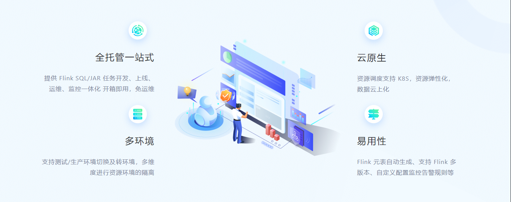
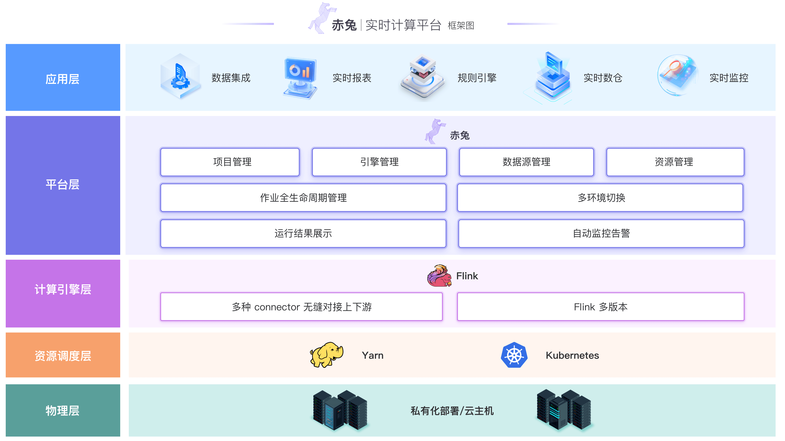
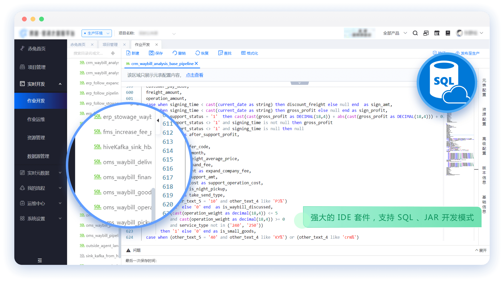
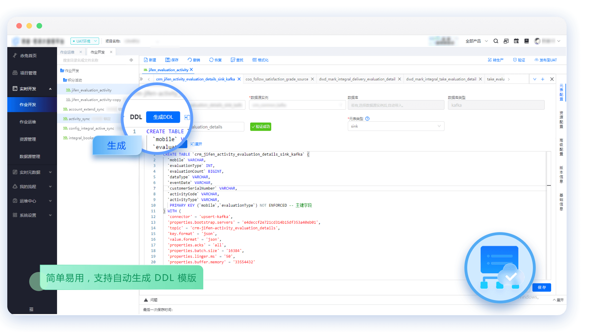
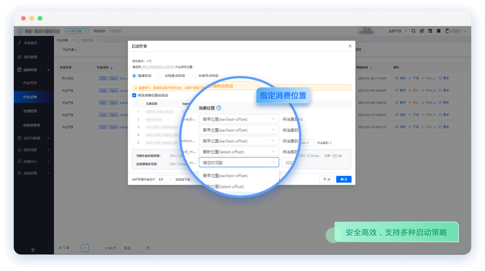

    <a href="https://galaxy-data-cn.github.io/chitu-sdp-website/">产品官网</a> | 
    <a href="http://183.57.45.188/#/login">体验环境</a> | 
    <a href="https://galaxy-data-cn.github.io/chitu-sdp-website/">视频介绍</a>

---

## 产品简介
### 概述
[赤兔实时计算平台](https://galaxy-data-cn.github.io/chitu-sdp-website/)是跨越集团大数据生态体系的重要基石，具备开箱即用、一站式开发、亚秒级延时、统一 SQL 语言、端到端一致性、丰富的上下游支持、安全稳定等特点的企业级实时大数据计算平台。 赤兔平台提供 SQL 化的 IDE 开发环境，UI 化的任务发布及任务监控体系，支持多环境隔离及环境切换，可帮助企业快速实现实时应用开发与落地，加速企业面向实时数字化的建设进程。

### 特性
- 作业全生命周期可视化管理
- 支持 SQL 和原生 Jar 两种研发模式
- 根据元数据自动生成 SQL DDL 语句
- 企业级特性支持：多环境、多版本、多集群
- 内置丰富的上下游组件
- 内置完善的系统和组件监控

### 产品架构

### 产品速览

## 快速开始

* [Flink SQL 作业快速入门](https://galaxy-data-cn.github.io/chitu-sdp-website/pages/58ae2f/)
* [Flink DS 作业快速入门](https://galaxy-data-cn.github.io/chitu-sdp-website/pages/317f67/)

## 环境搭建部署

* [开发环境搭建](https://galaxy-data-cn.github.io/chitu-sdp-website/pages/e5dc37/)

* [源码构建部署](https://galaxy-data-cn.github.io/chitu-sdp-website/pages/f70b05/)

* [Docker 部署](https://galaxy-data-cn.github.io/chitu-sdp-website/pages/3afb01/)

## 获取帮助
如果您在使用过程中有任何疑问或对建议，欢迎提交 [GitHub Issue](https://github.com/galaxy-data-cn/chitu-sdp/issues/new) 或加入社区与我们进一步交流沟通。

可以扫码添加小助手，进入赤兔开源社区交流群

  

  

## 联系我们

### Maintainer
- 苏涛, st_start#163.com
- 李建国, 767102105#qq.com

### Committer
- 廖伟, liaowei2006_2006#126.com 
- 邹倡振, 745596015#qq.com
- 林维建, 969692020#qq.com 
- 李啟炬, 549202228#qq.com 
- 张静瑜, 12260035#qq.com 
- 张杰, jensen_zhang#139.com
- 张祥林, shylinzhang#163.com 
- 邓栋花, 2243186407#qq.com
- 陈敏, minchen0168#163.com

### PMC
- 商渭清 (PMC Chair), sang.williams#gmail.com
- 唐安律 (Vice Chair), lvvhebe#gmail.com  
- 刘斌 (Vice Chair), sunnykaka0721#gmail.com

## License

Licensed under The GNU General Public License version 3 (GPLv3)  (the "License"); you may not use this file except in compliance with the License. You may obtain a copy of the License at

<https://www.gnu.org/licenses/gpl-3.0.html>

Unless required by applicable law or agreed to in writing, software distributed under the License is distributed on an "AS IS" BASIS, WITHOUT WARRANTIES OR CONDITIONS OF ANY KIND, either express or implied. See the License for the specific language governing permissions and limitations under the License.
