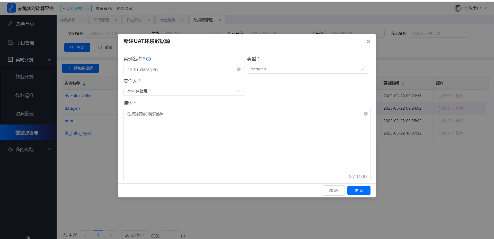
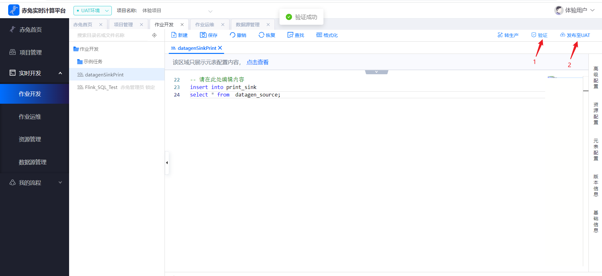
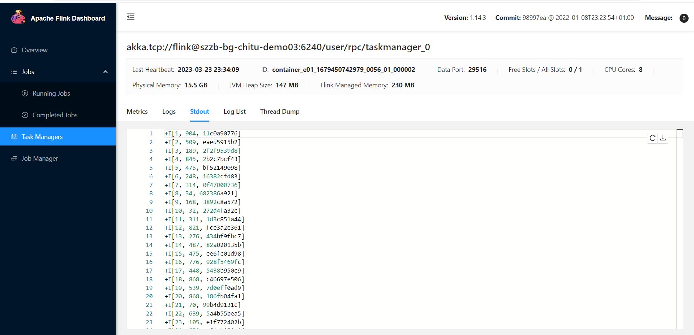

## Flink SQL快速入门
### 前提条件

##### 进入项目

首先要有对应的项目，进入到对应的项目进行开发，可以在`项目管理`中进入或者在`作业开发`中切换项目，若没有对应的项目则需要让项目管理员或者系统管理员进行添加。

##### **计算引擎**

`计算引擎`即运行的集群环境，比如yarn集群，需在nacos配置文件中配置，项目中要有关联的`计算引擎`，在开发作业时才能选择对应的引擎进行运行，具体可在`用户手册`的`引擎管理`中查看。

##### 添加数据源

在`实时开发` 里的`数据源管理`添加用到的数据源，这里以 datagen -> print为例

### 步骤一：创建SQL作业

在`实时开发`里的`作业开发`新建作业，文件类型选择sql

### 步骤二：编辑SQL语句

新建完成后双击作业进入编辑，这里以datagen输出到控制台print为例

1、点击`元表配置`新增flink源表。

2、新增source表，数据源实例选择datagen，然后点击`生成DDL`选择要保留的字段

3、新增sink表，同样的创建print表。

4、点击保存。

5、编辑元表信息完后关闭窗口。

### 步骤三：验证及发布

创建元表后就可以写sql做逻辑处理了，编写sql后点击`保存`然后点击`验证`可以验证其语法正确性，在验证完后就可以`发布至UAT`环境或者`转生产`(等效于在生产环境创建一个一样的作业)。

### 步骤四：启动

在发布完UAT环境之后，在`作业运维`中可以看到发布的作业，刚上线的作业为初始状态，点击`启动`。

### 步骤五：查看运行情况

启动后可以看到作业在`运行中`的状态，可以点击右侧`flink_ui`查看flink运行情况，至此一个简单的作业就启动起来了。

