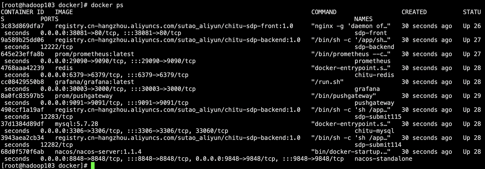

# Docker 部署

## 1. 下载项目

```
clone https://github.com/galaxy-data-cn/chitu-sdp.git
```

## 2. 启动服务

**2.1 进入项目部署路径下**

```
cd chitu-sdp/docs/deploy/docker
```

**2.2 启动**

```
docker-compose -f docker-compose.yml up  -d
```

**2.3 查看服务状态**



**2.4 查看后端服务日志**

```
docker exec -it sdp-backend bash
tail -f /app/logs/chitu-provider-1.0.0-SNAPSHOT-12222-start.out 
```

## 3. 登录平台

http://宿主机地址:38081/


<!--Tips：如需体验提交任务，需要提前准备好 Hadoop 并参考附录 4.3 进行配置。-->


## 4. 附录

### 4.1 安装 docker

```
sudo yum remove docker \
                  docker-client \
                  docker-client-latest \
                  docker-common \
                  docker-latest \
                  docker-latest-logrotate \
                  docker-logrotate \
                  docker-selinux \
                  docker-engine-selinux \
                  docker-engine
sudo yum install -y yum-utils device-mapper-persistent-data lvm2
sudo yum-config-manager --add-repo http://mirrors.aliyun.com/docker-ce/linux/centos/docker-ce.repo 
sudo yum makecache fast
sudo yum install docker-ce docker-ce-cli containerd.io
sudo systemctl start docker
docker version
```

### 4.2 安装 docker-compose

```
wget https://github.com/docker/compose/releases/download/v2.12.2/docker-compose-linux-x86_64 -O /usr/bin/docker-compose
sudo chmod +x /usr/bin/docker-compose
docker-compose --version
```

### 4.3 配置 hadoop 环境

**安装 hadoop 集群**

步骤省略...

**下载 flink 安装包**

```
wget https://archive.apache.org/dist/flink/flink-1.14.3/flink-1.14.3-bin-scala_2.11.tgz
wget https://archive.apache.org/dist/flink/flink-1.15.2/flink-1.15.2-bin-scala_2.12.tgz 
```

**配置 hadoop 环境 Dockerfile**

vi Dockerfile

```
FROM registry.cn-hangzhou.aliyuncs.com/sutao_aliyun/chitu-sdp-backend:1.0
RUN mkdir -p /opt/apache
ADD flink-1.14.3-bin-scala_2.11.tgz /opt/apache/
ADD flink-1.15.2-bin-scala_2.12.tgz /opt/apache/
# 这个 hadoop 根据自己的环境进行替换
ADD hadoop-3.1.4.tar.gz /opt/apache/
RUN ln -s /opt/apache/hadoop-3.1.4 /opt/apache/hadoop
ENV HADOOP_HOME=/opt/apache/hadoop
```

**构建镜像**

```
docker build -t registry.cn-hangzhou.aliyuncs.com/sutao_aliyun/chitu-sdp-backend:1.0 . --no-cache
```

**创建 hdfs 目录，上传 flink 核心基础 jar包**

```
hdfs dfs -mkdir -p /sdp/savepoints
hdfs dfs -mkdir -p /sdp/ck
hdfs dfs -mkdir -p /sdp/plugins
hdfs dfs -mkdir -p /sdp/flink

wget https://github.com/galaxy-data-cn/chitu-sdp/releases/download/v0.1.0/chitu-sdp-flink-sqlclient-1.14-1.0.0-SNAPSHOT.jar
wget https://github.com/galaxy-data-cn/chitu-sdp/releases/download/v0.1.0/chitu-sdp-flink-sqlclient-1.15-1.0.0-SNAPSHOT.jar
hdfs dfs -put chitu-sdp-flink-sqlclient-1.14-1.0.0-SNAPSHOT.jar /sdp/plugins
hdfs dfs -put chitu-sdp-flink-sqlclient-1.15-1.0.0-SNAPSHOT.jar /sdp/plugins

tar -zxvf flink-1.14.3-bin-scala_2.11.tgz
tar -zxvf flink-1.15.2-bin-scala_2.12.tgz 
hdfs dfs -put flink-1.14.3 /sdp/flink
hdfs dfs -put flink-1.15.2 /sdp/flink
```

**修改 docker-compose.yml**

修改 extra_hosts 配置，改成自己的 hadoop 集群主机名 ip 映射

```
version: '4'
services:
  sdp_front:
    image: registry.cn-hangzhou.aliyuncs.com/sutao_aliyun/chitu-sdp-front:1.0
    container_name: sdp-front
    restart: always
    ports:
      - 38081:80
    depends_on: 
      - sdp_backend
  sdp_backend:
    image: registry.cn-hangzhou.aliyuncs.com/sutao_aliyun/chitu-sdp-backend:1.0
    container_name: sdp-backend
    restart: always
    depends_on: 
      - sdp_submit114
      - sdp_submit115
      - nacos
      - redis
      - mysql
    extra_hosts:
      - "hadoop01:172.16.81.161"
      - "hadoop02:172.16.81.162"
      - "hadoop03:172.16.81.163"
    expose:
      - 12222
    command: /bin/sh -c "/app/sh/bigdata-services start chitu-provider-1.0.0-SNAPSHOT 12222"
  sdp_submit114:
    image: registry.cn-hangzhou.aliyuncs.com/sutao_aliyun/chitu-sdp-backend:1.0
    container_name: sdp-submit114
    restart: always
    expose:
      - 12282
    extra_hosts:
      - "hadoop01:172.16.81.161"
      - "hadoop02:172.16.81.162"
      - "hadoop03:172.16.81.163"
    command: /bin/sh -c "sh /app/sh/bigdata-services start chitu-flink-submit-114-1.0.0-SNAPSHOT 12282"
  sdp_submit115:
    image: registry.cn-hangzhou.aliyuncs.com/sutao_aliyun/chitu-sdp-backend:1.0
    container_name: sdp-submit115
    restart: always
    expose:
      - 12283
    extra_hosts:
      - "hadoop01:172.16.81.161"
      - "hadoop02:172.16.81.162"
      - "hadoop03:172.16.81.163"
    command: /bin/sh -c "sh /app/sh/bigdata-services start chitu-flink-submit-115-1.0.0-SNAPSHOT 12283"
  nacos:
    image: nacos/nacos-server:1.1.4
    container_name: nacos-standalone
    environment:
      - PREFER_HOST_MODE=hostname
      - MODE=standalone
    ports:
      - "8848:8848"
      - "9848:9848"
  prometheus:
    container_name: prometheus
    image: prom/prometheus:latest
    volumes:
      - ./prometheus/prometheus-standalone.yaml:/etc/prometheus/prometheus.yml
    ports:
      - "29090:9090"
    depends_on:
      - nacos
    restart: on-failure
  grafana:
    container_name: grafana
    image: grafana/grafana:latest
    ports:
      - 30003:3000
    restart: on-failure
  pushgateway:
    image: prom/pushgateway
    container_name: pushgateway
    user: root
    restart: always
    ports:
      - "9091:9091"
  redis:
    restart: always
    image: redis
    container_name: chitu-redis
    ports:
      - 6379:6379
    command: redis-server
  mysql:
    container_name: chitu-mysql
    environment:
            MYSQL_ROOT_PASSWORD: "123456"
            MYSQL_USER: 'chitu'
            MYSQL_PASS: '123456'
    image: mysql:5.7.28
    restart: always
    volumes:
         - "./init:/docker-entrypoint-initdb.d/"
    ports:
         - "3306:3306"
```

**重启服务**

```
docker-compose -f docker-compose.yml down
docker-compose -f docker-compose.yml up  -d
```
