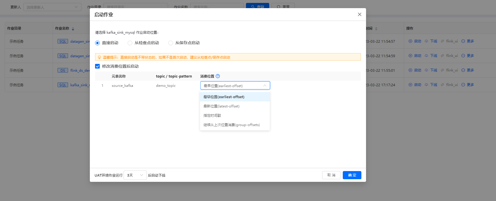
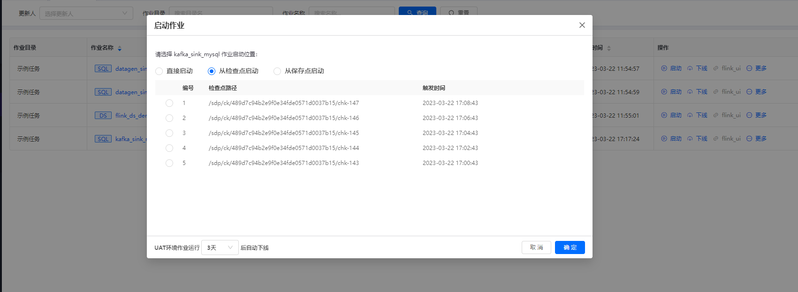
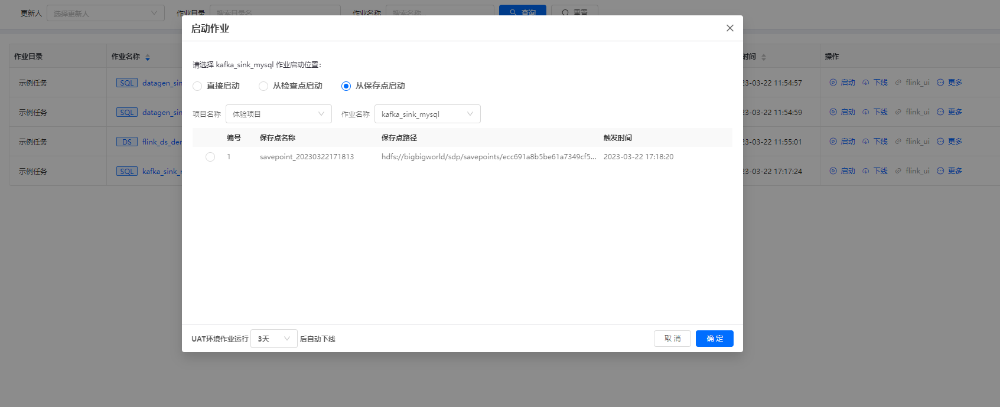

# 任务操作

## 启动

### 指定消费位置启动

指定消费位置启动是不带状态的，一般是任务首次上线启动时选择。

### 指定检查点启动

会保留任务上次运行结束前的状态（kafka 偏移量/key的状态），如果不是首次启动，建议从检查点启动。

### 指定保存点启动

会保留任务上次运行结束前的状态（kafka 偏移量/key的状态），当应用升级 Flink 版本或者较大代码变更时，建议从保存点启动。

## 停止

将运行中的任务停止，平台默认会保留任务最近的5次检查点数据。

## 暂停

将运行中的任务停止，平台默认会保留任务最近的5次检查点数据。

## 恢复

从最近一次检查点状态启动任务。

## 下线

下线实际就是将作业上线的实例删除，作业文件还是存在的。
