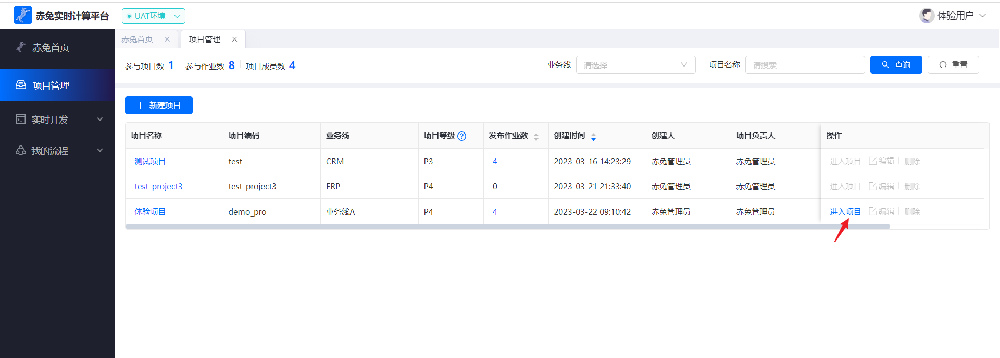
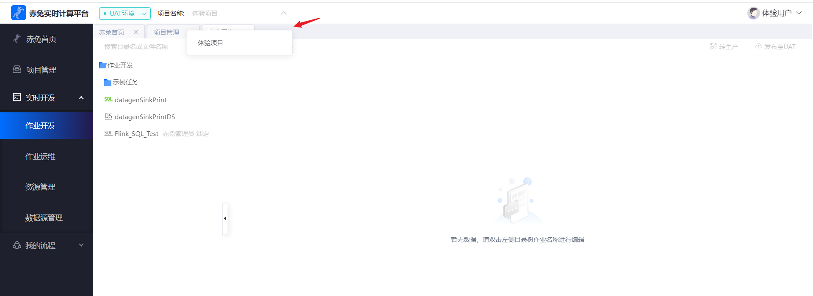
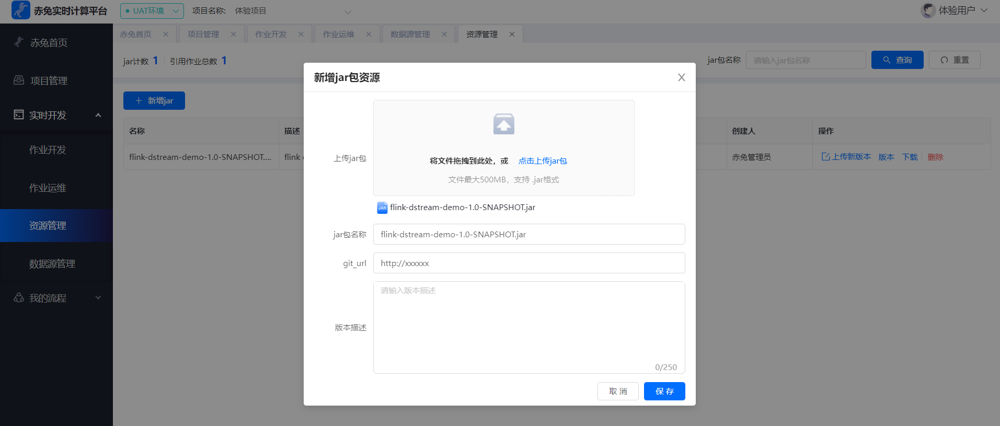
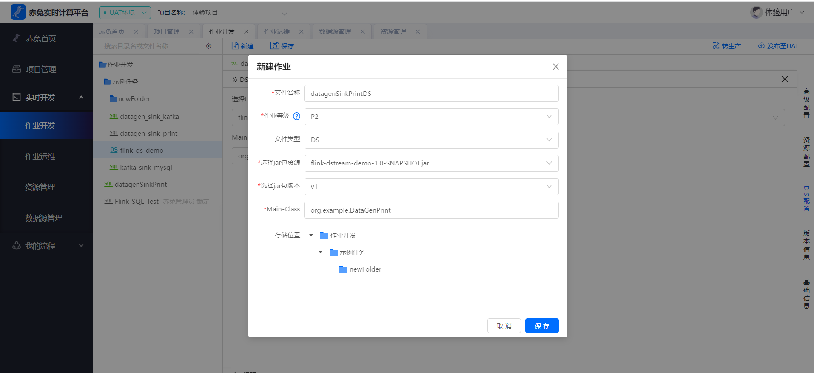
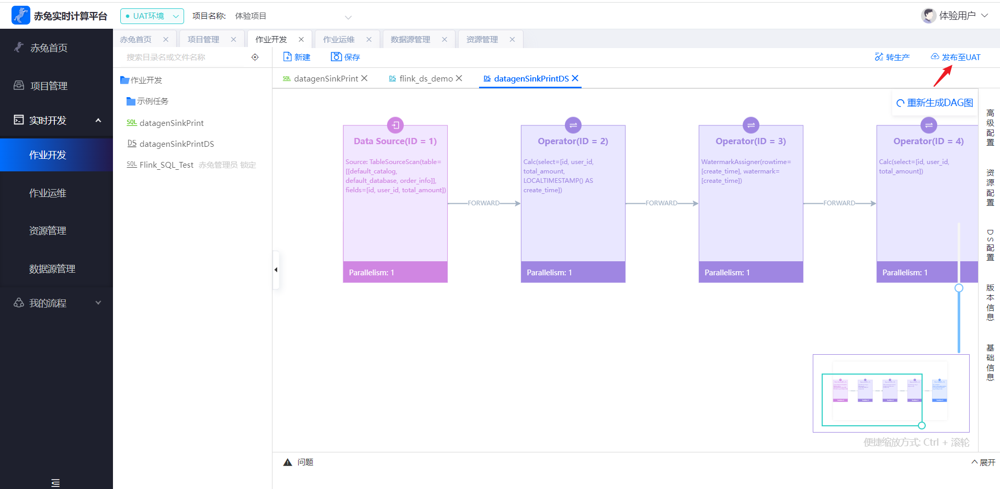
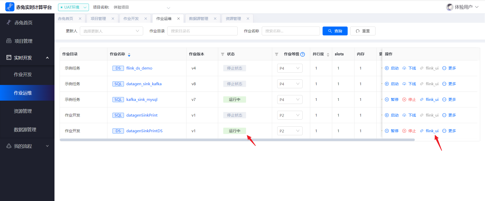
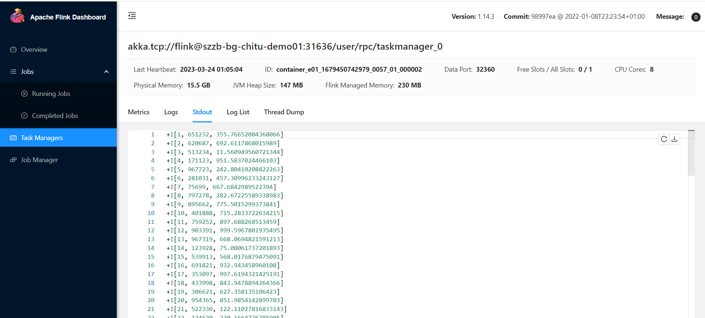

## 开发JAR作业
### 前提条件
##### **进入项目**

要有对应的项目，进入到对应的项目进行开发，可以在`项目管理`中`进入项目`或者在`作业开发`中切换项目，若没有对应的项目则需要项目管理员或者系统管理员进行添加，`项目管理`相关操作可以在用户手册中查看。






##### **计算引擎**

`计算引擎`即运行的集群环境，比如yarn集群，需在nacos配置文件中配置，项目中要有关联的`计算引擎`，在开发作业时才能选择对应的引擎进行运行，具体可在`用户手册`的`引擎管理`中查看。


##### **准备jar作业**

首先先写dataStream流作业，写完后打jar包上传，这里以datagen输出到print控制台为例


引入依赖

```
<properties>
    <maven.compiler.source>8</maven.compiler.source>
    <maven.compiler.target>8</maven.compiler.target>
    <flink.version>1.14.3</flink.version>
    <scala.binary.version>2.11</scala.binary.version>
</properties>

<dependencies>
    <dependency>
        <groupId>org.apache.flink</groupId>
        <artifactId>flink-table-api-java-bridge_${scala.binary.version}</artifactId>
        <version>${flink.version}</version>
        <scope>provided</scope>
    </dependency>
</dependencies>
```


编写流作业代码

```
import org.apache.flink.api.java.utils.ParameterTool;
import org.apache.flink.configuration.PipelineOptions;
import org.apache.flink.streaming.api.environment.StreamExecutionEnvironment;
import org.apache.flink.table.api.bridge.java.StreamTableEnvironment;

public class Demo03_DataGen_Print {

    public static void main(String[] args) {
    
        //通过该方式获取高级配置定义的main参数
        ParameterTool parameterTool = ParameterTool.fromArgs(args);
        parameterTool.toMap().forEach((k, v) -> {
            //  System.out.println(k + ":" + v);
        });
        String jobName = parameterTool.get("main.param.pipeline.name","Demo03_DataGen_Print");
        System.out.println("jobName = " + jobName);
        StreamExecutionEnvironment env = StreamExecutionEnvironment.getExecutionEnvironment();
        StreamTableEnvironment tableEnv = StreamTableEnvironment.create(env);
        env.setParallelism(1);
        tableEnv.getConfig().getConfiguration().setString(PipelineOptions.NAME,jobName);
        
        String orderSql="CREATE TABLE order_info (\n" +
            "    id INT,\n" +        "    user_id BIGINT,\n" +
            "    total_amount DOUBLE,\n" +
            "    create_time AS localtimestamp,\n" +
            "    WATERMARK FOR create_time AS create_time\n" +
            ") WITH (\n" +
                "    'connector' = 'datagen',\n" +
                "    'rows-per-second'='1',\n" +
                "    'fields.id.kind'='sequence',\n" +
                "    'fields.id.start'='1',\n" +
                "    'fields.id.end'='1000000',\n" +
                "    'fields.user_id.kind'='random',\n" +
                "    'fields.user_id.min'='1',\n" +
                "    'fields.user_id.max'='1000000',\n" +
                "    'fields.total_amount.kind'='random',\n" +
                "    'fields.total_amount.min'='1',\n" +
                "    'fields.total_amount.max'='1000'\n" +
                ")";
                
        String sinkSql="CREATE TABLE sink_order_info (\n" +
            "    id INT,\n" +        "    user_id BIGINT,\n" +
            "    total_amount DOUBLE,\n" +
            "    create_time AS localtimestamp,\n" +
            "    WATERMARK FOR create_time AS create_time\n" +
            ") WITH (\n" +
            "    'connector' = 'print'\n" +
            ")";
         
        tableEnv.executeSql(orderSql);
        tableEnv.executeSql(sinkSql);
        tableEnv.executeSql("insert into sink_order_info select id,user_id,total_amount from order_info");
        
     }
 }

```


### 步骤一：上传jar包

选择`实时开发`菜单中的`资源管理`，上传打包好的作业jar包，若使用同样的jar包可在原来的版本基础上新增一个版本。

**jar包名称：** 自定义名称

**git_url：** jar包所在的git地址

**版本描述：** 自定义描述




### 步骤二：创建jar作业

然后在作业开发中选择DS文件类型的作业，选择上传的jar包资源及版本，填写运行入口。

**文件名称：** 英文与数字组成不可包含空格特殊字符等

**作业等级：** 从p1到p4为从重要到不重要

**文件类型：** 选择DS即dataStream作业

**选择jar包资源：** 选择上传的jar包

**选择jar包版本：** 对应jar包的版本

**Main-Class：** 程序执行入口




### 步骤三：发布jar作业

保存后可以看到根据作业生成的DAG图，可根据需要做一些参数配置

**高级配置：** 为flink作业运行时相关的一些参数

**资源配置：** 为作业所需资源的参数配置

**DS配置：** 为jar版本及main入口相关配置

**版本信息：** 为发布后生成的记录可以查看每次发布的差异，类似git

**基础信息：** 为作业的相关基础信息如作业名称，作业创建时间更新时间等




### 步骤四：运行jar任务

在uat环境默认不用审批，若在prod环境则需要进行审批，在uat发布后可以`作业运维`看到发布的作业为`初始状态`，点击启动可以选择直接启动、从检查点启动、保存点启动。


### 步骤五：查看运行情况

启动后可以看到作业在`运行中`的状态，flink jar作业就启动起来了，可点击右侧`flink_ui`中查看运行状态。


