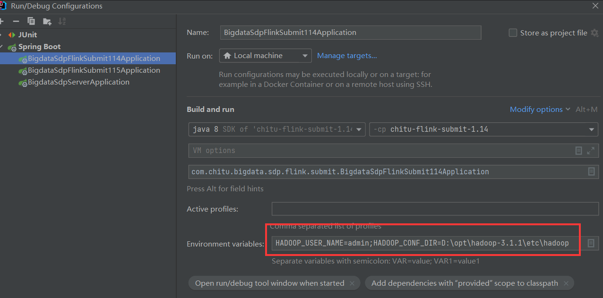
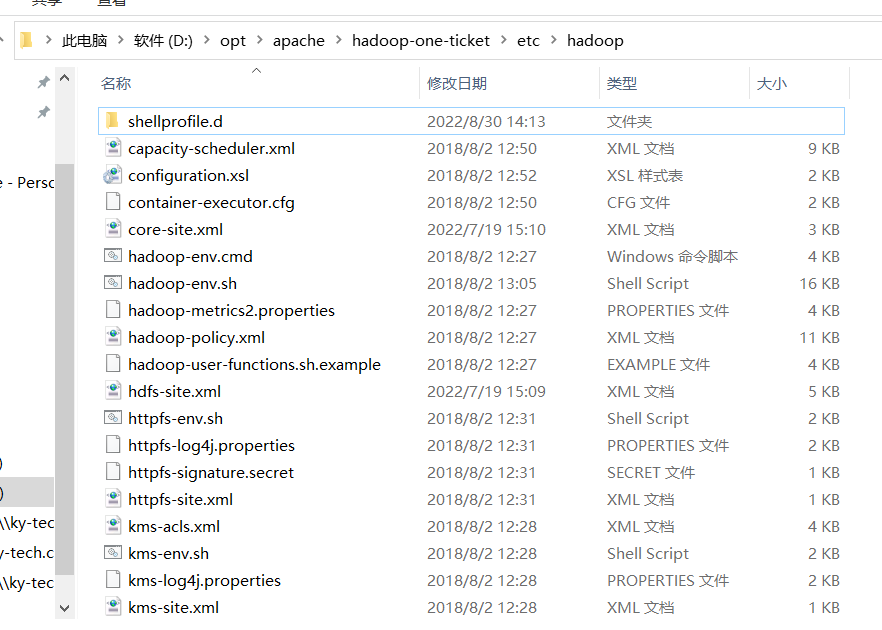
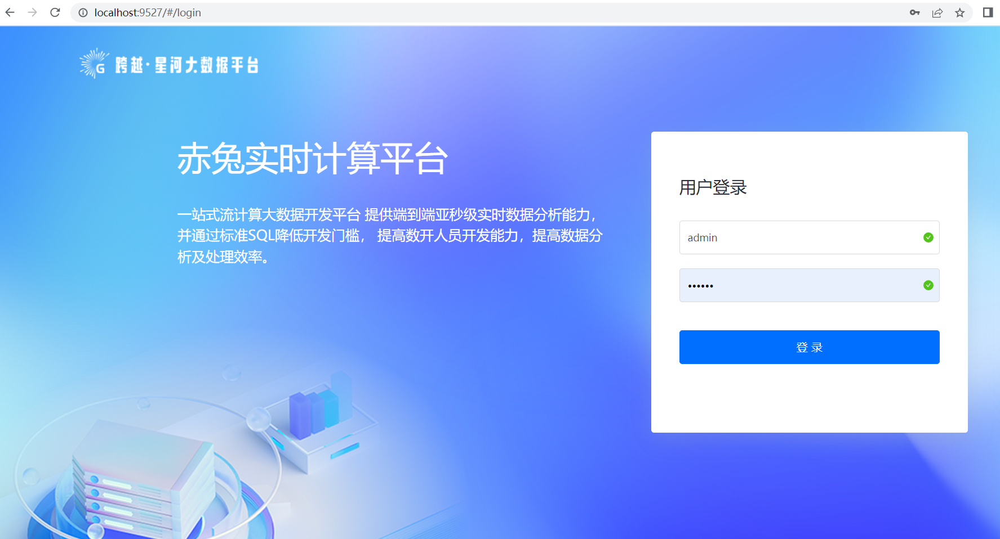
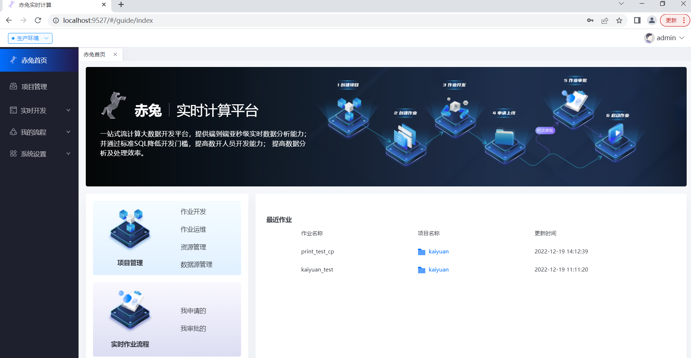
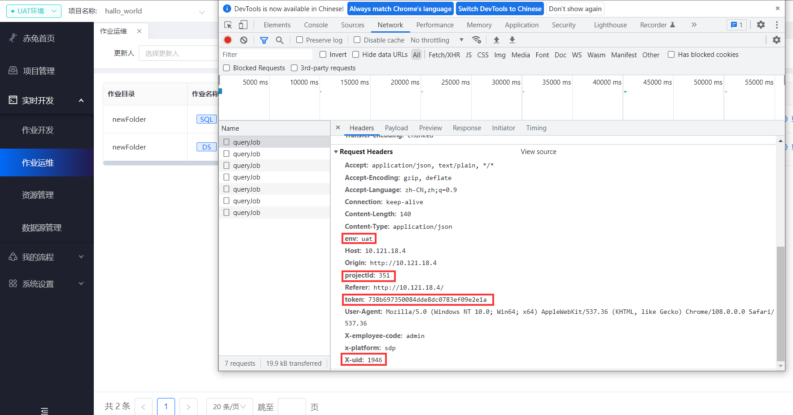
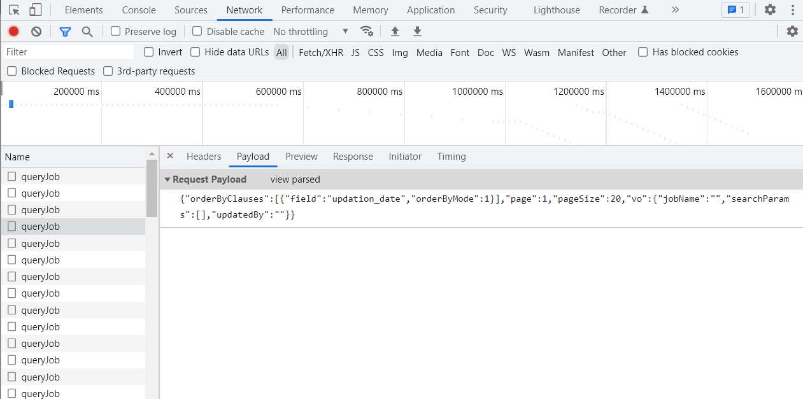
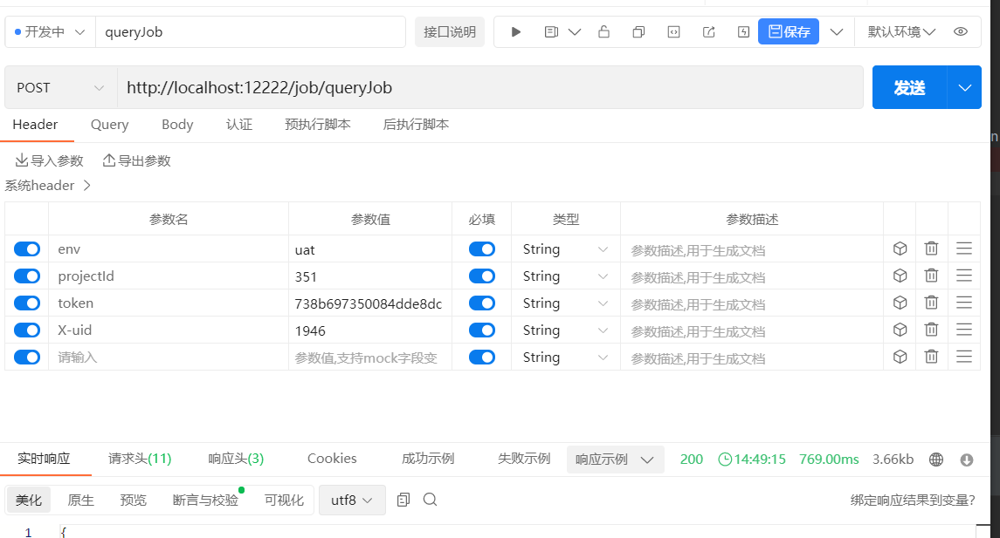
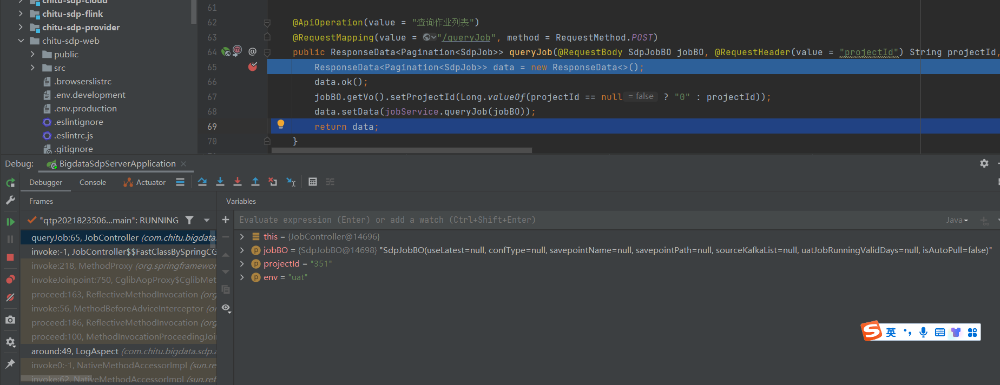

## 开发环境搭建
### 前置条件
在搭建赤兔开发环境之前请确保你已经安装如下软件

* Git：版本控制软件
* JDK：后端开发
* Maven：Java依赖包管理
* Node：前端开发

#### 环境要求
| **环境** | **版本** |
| --- | --- |
| node.js | 14.20.1 |
| jdk | 1.8 |
| maven | 3.6.0+ |
| lombok | IDEA插件安装 |
| mysql | 5.7+ |

#### 代码克隆
```
git clone https://github.com/galaxy-data-cn/chitu-sdp.git
```

### IntelliJ IDEA

该指南介绍了关于如何设置 IntelliJ IDEA 来进行赤兔本地前后端开发。Eclipse 不建议使用。以下文档描述了 IntelliJ IDEA 2021.3 的运行步骤。所以以下简称 IDEA 来表示 IntelliJ IDEA 。

#### 安装 Lombok 插件

IDEA 提供了插件设置来安装 Lombok 插件。如果尚未安装，请在导入赤兔之前按照以下说明来进行操作以启用对 Lombok 注解的支持：

1. 转到 IDEA Settings → Plugins 并选择 Marketplace 。
2. 选择并安装 Lombok 插件。如果出现提示，请重启IDEA。
#### 导入赤兔

1. 启动 IDEA 并选择 Open。
2. 选择已克隆的赤兔项目存储库的根文件夹。
3. 等待项目加载完成。
4. 设置 JDK 1.8 和 Maven 3.6.0。
### 前端环境
#### 下载    node.js 版本：v14.20.12. 
#### 安装    
**方式一** **使用npm安装**  

    npm install    

**方式二** **使用淘宝镜像安装**  

    npm install cnpm -g --registry=https://registry.npm.taobao.org
    cnpm install

**方式三** **使用yarn安装**

    npm install       
    yarn
#### 本地环境配置    

* 打开 vue.config.js，修改服务端地址，PROXY_ENV 设置成 'dev'，targets 对象的 dev 属性设置为 'http://127.0.0.1:12222'，请根据你本地服务端的地址及端口修改    

* 配置 devServer 的 proxy，请求后端接口统一添加一个根路径'/sdp'（如果不用/sdp，请同步修改src/utils/config.js中confg对象的apiRoot），用于解决前端跨域问题  

#### 本地运行        
npm run dev 

浏览器打开http://localhost:9527/ ，账号密码：admin/123456


### 后端开发环境
#### 配置mysql
参考如下：
```
spring:
  datasource:
    type: com.zaxxer.hikari.HikariDataSource
    driverClassName: com.mysql.jdbc.Driver
    url: jdbc:mysql://localhost:3306/sdp?tinyInt1isBit=false&useUnicode=true&characterEncoding=utf-8&autoReconnect=true&failOverReadOnly=false&zeroDateTimeBehavior=convertToNull&useSSL=false&serverTimezone=Asia/Shanghai&allowMultiQueries=true
    username: xxx
    password: xxx
```
#### 配置redis
参考如下：
```
redis:
    host: localhost
    port: 6379
    password: xxx
    database: 10
    timeout: 3000
    pool:
      max-active: 2000
      max-idle: 20
```
#### 初始化数据库

执行项目路径/docs/sql下的sql文件。

#### 配置hadoop环境变量

需要在IDEA中的Environment variables配置HADOOP_USER_NAME 和 HADOOP_HOME， HADOOP_USER_NAME 为具有 HDFS 读写权限的 Hadoop 用户名，HADOOP_HOME为开发机上Hadoop配置存放路径。

例如：HADOOP_USER_NAME=admin;HADOOP_HOME=D:\opt\apache\hadoop-3.1.1


另外在配置文件中配置的hadoopConfDir在本地与项目同盘下需要有相应的hadoop目录及配置文件。
例如：


#### 启动后端服务
启动 chitu-sdp-provider 下的启动类，默认使用12222端口。

启动 chitu-sdp-flink-submit-1.14 下的启动类，默认使用12282端口。

启动 chitu-sdp-flink-submit-1.15 下的启动类，默认使用12283端口。

#### 本地源码调试示例
在IDEA启动后，等待几分钟，访问http://localhost:9527/ 即可看到登录页，如下：


输入账号密码后即可登录到赤兔平台，这个时候就可以基于本地做二次开发了。另外任务需要使用到的集群及flink相关配置可自行在配置文件上进行配置。



#### 本地接口调试
打开开发者工具，查看请求头，一般请求需要在请求头赋上env、projectId、token、X-uid这几个参数。



以/job/queryJob接口为例，复制请求头以及请求体数据，粘贴到api工具进行修改调试。




此时就请求到本地项目可以进行调试了。