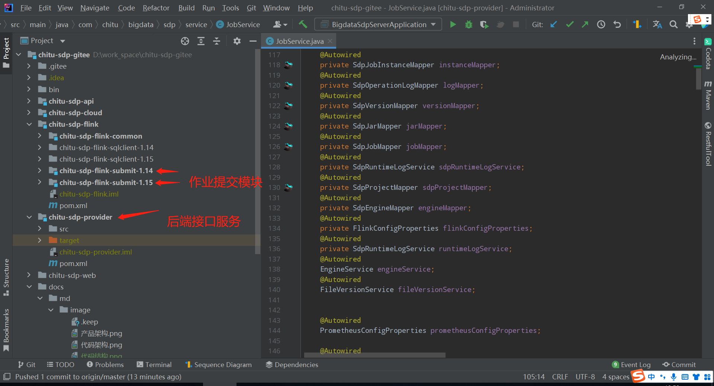

# Linux 环境源码构建部署

赤兔实时计算平台 总体组件栈架构如下， 由 chitu-sdp-provider 、chitu-sdp-flink-submit-114（chitu-sdp-flink-submit-115）、chitu-sdp-web 三个大的部分组成 , 前后端分离的开发模式。chitu-sdp-web 是前端页面模块,  chitu-sdp-provider 后端接口模块，支持微服务开发部署，chitu-sdp-flink-submit-114（chitu-sdp-flink-submit-115）作业提交模块。



## 环境要求

| **要求**     | **版本** | **是否必须** | **备注** |
|------------| --- | --- | --- |
| 操作系统       | Linux | 是 | 暂不支持 window 系统  |
| Java       | 1.8+ | 是 |  |
| Scala      | 2.1.1 | 是 |  |
| Maven      | 3+  | 是  | 编译 Java 程序需要使用到 |
| Flink      | 1.14.x & 1.15.x  | 是  | 任务提交模块部署机器需要安装 Flink  |
| Hadoop     | 3+  | 否 | Flink on Yarn 则需要 Hadoop 环境,并且配置好相关环境变量 |
| Kubernetes |   | 否 | Flink on K8s |
| MySQL      | 5.7+ | 是 | 部署机器或者其他机器安装MySQL |
| Redis      | 5+  | 是 |  |
| Nacos      |  | 否  | 可以使用本地配置部署的方式也可以通过微服务的方式部署 |
| nodejs     | 14.18.x  | 是  |  |
| npm        | 6.14.x  | 是  |  |

## MySQL

赤兔实时计算平台采用 MySQL 作为后端的存储库，MySQL 支持 5.7+。需要创建一个chitu的数据库实例，执行初始化脚本(根目录/docs/sql)，然后在后端配置文件中配置好 MySQL 的连接地址、用户名和密码。

创建数据库
```bash
#登录mysql
mysql -uroot -proot@123
#创建数据库
mysql>
create database chitu;
#授权
mysql>
grant all privileges on chitu.* to 'chitu'@'%' identified by 'Chitu@2023' with grant option;
mysql>
flush privileges;
#此处用 chitu 用户登录
mysql -h ip或域名 -P 端口 -uchitu -pChitu@2023
```

在该数据库实例下面执行建表语句和初始化脚本:

```base
#切换到 chitu 的数据库
mysql>
use chitu;
#执行ddl和dml初始化脚本
mysql>
source 项目路径/docs/sql/ddl;
mysql>
source 项目路径/docs/sql/dml;
```

后端配置
```bash
spring:
  datasource:
    type: com.zaxxer.hikari.HikariDataSource
    driverClassName: com.mysql.jdbc.Driver
    url: jdbc:mysql://ip:端口/chitu?tinyInt1isBit=false&useUnicode=true&characterEncoding=utf-8&autoReconnect=true&failOverReadOnly=false&zeroDateTimeBehavior=convertToNull&useSSL=false&serverTimezone=Asia/Shanghai&allowMultiQueries=true
   username: 用户名
   password: 密码

```


## Redis

赤兔实时计算平台会使用 Redis 缓存后端数据。安装好之后，需要在后端配置文件里面配置连接、用户名和密码。

后端配置
```bash
spring:
  redis:
    host: ip或域名
    port: 端口
    password: 密码
```

## Hadoop

安装 Hadoop 集群

使用 Flink on Yarn，需要部署的集群安装并配置 Hadoop 的相关环境变量， 相关环境变量可以参考如下配置:

```bash
export JAVA_HOME=/usr/local/jdk
export PATH=$PATH:$JAVA_HOME/bin:$JAVA_HOME/sbin
export PATH=$PATH:/usr/local/scala/bin
export HADOOP_HOME=/opt/apache/hadoop
export PATH=$PATH:$HADOOP_HOME/bin:$HADOOP_HOME/sbin
export HADOOP_CLASSPATH=`hadoop classpath
```

后端配置
```bash
yarn:
  envMap:
    uat:
      defaultConfig:
        #默认队列
        queue: default
      clusters:
      - clusterName: uat赤兔yarn集群  #集群名称
        clusterCode: chitu #集群编码
		#任务使用Flink 1.14.x版本部署
        flinkClient114Url: http://127.0.0.1:12282 
		#任务使用Flink 1.15.x版本部署
        flinkClient115Url: http://127.0.0.1:12283
        hadoopConfDir: /opt/apache/hadoop/etc/hadoop
```


## Nginx
安装 Nginx
```bash
yum -y install nginx
```
配置
```bash
upstream sdp{
    server 10.121.18.2:12281 max_fails=0 fail_timeout=15s;
}
server {
    listen       80;
    server_name  10.121.18.4;
    client_max_body_size  500M;
    add_header 'Access-Control-Allow-Origin' '*';
    add_header 'Access-Control-Allow-Methods' 'GET, POST, OPTIONS';
    add_header 'Access-Control-Allow-Headers' 'DNT,X-CustomHeader,Keep-Alive,User-Agent,X-Requested-With,If-Modified-Since,Cache-Control,Content-Type';
   
    if ($request_method !~ ^(GET|HEAD|POST)) {
        return 444;
    }
    proxy_connect_timeout 10m;
    proxy_read_timeout  10m;
    proxy_send_timeout  10m;
    send_timeout 10m;
   
    location / {
                try_files $uri $uri/ /index.html;
                root   /etc/nginx/html/chitu-sdp-web;
                index  index.html index.htm;
    }
    location /sdp/ {
        proxy_http_version                1.1;
        proxy_set_header Host             $host:$server_port;
        proxy_set_header X-Real-IP        $remote_addr;
        proxy_set_header X-Forwarded-For  $proxy_add_x_forwarded_for;
        proxy_set_header Cookie           $http_cookie;
        proxy_set_header Upgrade          $http_upgrade;
        proxy_set_header Connection       "";
        proxy_pass http://sdp/;
    }
}
```

## 前端编译和部署

前端构建组件安装
```bash
1.下载node.js 版本：v14.20.1 地址:https://nodejs.org/download/release/v14.20.1/
wget https://nodejs.org/download/release/v14.20.1/node-v14.20.1-linux-arm64.tar.gz
2.npm install cnpm -g --registry=https://registry.npm.taobao.org
```
打包
```bash
cd /usr/local
git clone 赤兔开源地址
cd chitu-sdp/chitu-sdp-web
npm run build
```
部署
```bash
cd /etc/nginx/html/chitu-sdp-web
把dist目录下的文件全部打包放到nginx服务器
```
参考: [前端依赖安装](../../chitu-sdp-web/README.md)

## 后端编译和部署

安装配置java、scala、maven等配置信息。

打包
```bash
cd /usr/local
git clone 赤兔开源项目地址
cd chitu-sdp
mvn clean install -Dscala.version=2.11.12 -Dscala.binary.version=2.11 -DskipTests
```


拷贝到相应的目录，chitu-sdp-provider.jar、chitu-sdp-flink-submit-114.jar、chitu-sdp-flink-submit-115.jar
```bash
cp /usr/local/chitu-sdp/chitu-sdp-provider/target/chitu-sdp-provider.jar /app/bigdata/chitu-sdp-provider.jar
cp /usr/local/chitu-sdp/chitu-sdp-flink/chitu-sdp-flink-submit-114/target/chitu-sdp-flink-submit-114-1.0.0-SNAPSHOT.jar /app/bigdata/chitu-sdp-flink-submit-114.jar
cp /usr/local/chitu-sdp/chitu-sdp-flink/chitu-sdp-flink-submit-115/target/chitu-sdp-flink-submit-115-1.0.0-SNAPSHOT.jar /app/bigdata/chitu-sdp-flink-submit-115.jar
```
启动、停止、重启等操作
```
cp 项目路径/bin/services.sh /app/sh/
sh /app/sh/services start  chitu-sdp-provider 12281
sh /app/sh/services stop chitu-sdp-provider 12281
sh /app/sh/services restart chitu-sdp-provider 12281

sh /app/sh/services start  chitu-sdp-flink-submit-114 12282
sh /app/sh/services stop chitu-sdp-flink-submit-114 12282
sh /app/sh/services restart chitu-sdp-flink-submit-114 12282

sh /app/sh/services start  chitu-sdp-flink-submit-115 12283
sh /app/sh/services stop chitu-sdp-flink-submit-115 12283
sh /app/sh/services restart chitu-sdp-flink-submit-115 12283
```

配置 Nginx
```bash
upstream sdp 下面的server地址修改为chitu-sdp-provider应用所在服务器对应的ip和端口
```

后端配置
```
yarn 配置下面的 flinkClient114Url 和 flinkClient115Url 分别配置为 chitu-sdp-flink-submit-114 和 chitu-sdp-flink-submit-115 所在机器对应的ip和端口
```


## 体验

上面已经部署完成，下面进入体验。登录用户：admin 123456


