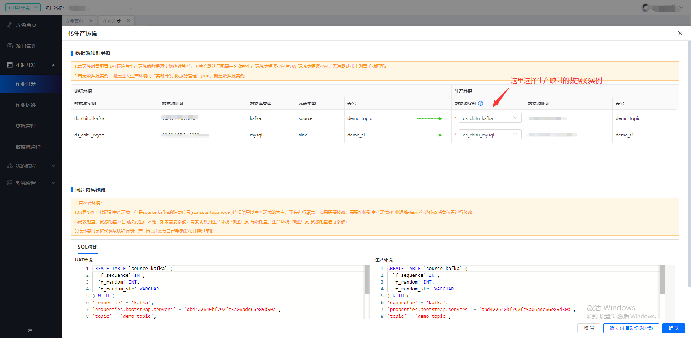

# 转生产环境

## 简介

一般建议是 UAT 环境作业数据验证通过后，就可以转生产，这里的转生产就是将 UAT 代码同步至生产环境，用户需要提前在生产环境创建好 UAT 环境对应的数据源，在转环境页面中选择映射数据源实例。

## 注意事项

- 仅同步作业代码到生产环境，但是 source kafka 的消费位置 (scan.startup.mode ) 选项信息以生产环境的为主，不会进行覆盖，如果需要修改，需要切换到生产环境-作业运维-启动-勾选修改消费位置进行修改。
- 高级配置、资源配置不会同步到生产环境，如果需要修改，需要切换到生产环境-作业开发-高级配置、生产环境-作业开发-资源配置进行修改。
- 转环境只是将代码从 UAT 转到生产, 上线还需要自己手动发布并经过审批。

